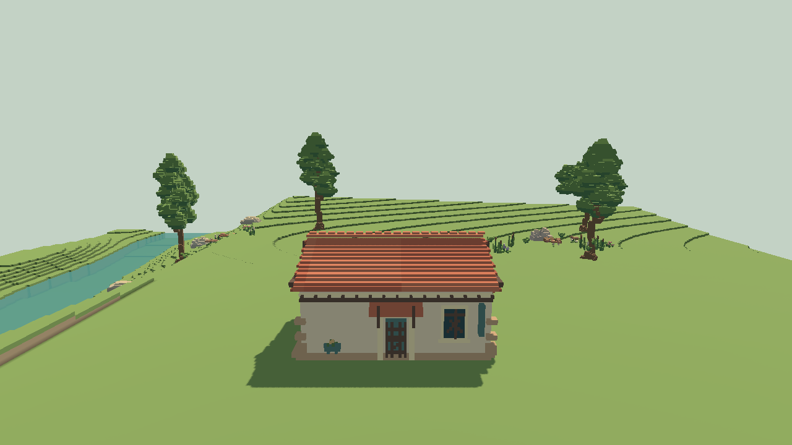

# M2-05 — Building decoration variants

Implemented on `feat/m2-hamlet-building` on 2026-09-09.

## Player-facing result

Every editable building-detail family now has a categorized Variation browser:

- seven window choices: classic and round cottage windows, a new cottage diamond, two lodge patterns, and two Tudor leaded patterns;
- six door choices: plank and stable cottage doors, two lodge braces, and two Tudor panels;
- four shutter choices: the saved legacy mix plus boarded, louvered, and diagonal-braced crafts;
- four flower-box choices: the saved legacy mix plus timber, bracketed, and woven planters.

The existing preview contract is retained. Browsing redraws the selected mesh immediately without changing the authoritative document; confirm records one edit, cancel restores the original, and the panel remains docked away from its target. The late playtest UI layer now exposes Variation for shutters and flower boxes as well as windows and doors.

Existing asset IDs are preserved, so old saves retain their prior deterministic craft. New explicit IDs select stable geometry. All detail geometry remains adaptive to the house surface and authored size, with decorative pieces quantized to the established `0.0625` tier.

## Verification

- Pinned Godot 4.7.2 import: pass.
- `tests/cottage_detail_visual_test.gd`: 264 checks, 0 failures.
- `tests/m1_cottage_edit_ux_test.gd`: pass, including read-only preview, one-revision commit, undo/redo, and exact save/reload IDs for shutters and planters.
- `tools/test-m1-placement.ps1`: pass.
- `tools/check.ps1`: pass.
- Actual D3D12 Forward Mobile run on NVIDIA GeForce RTX 3070 at 1280×720: `tests/m2_decoration_variants_render_test.gd`, 11 checks, 0 failures.

Physical Thor feel/performance and player visual approval remain separate from desktop Mobile verification.
