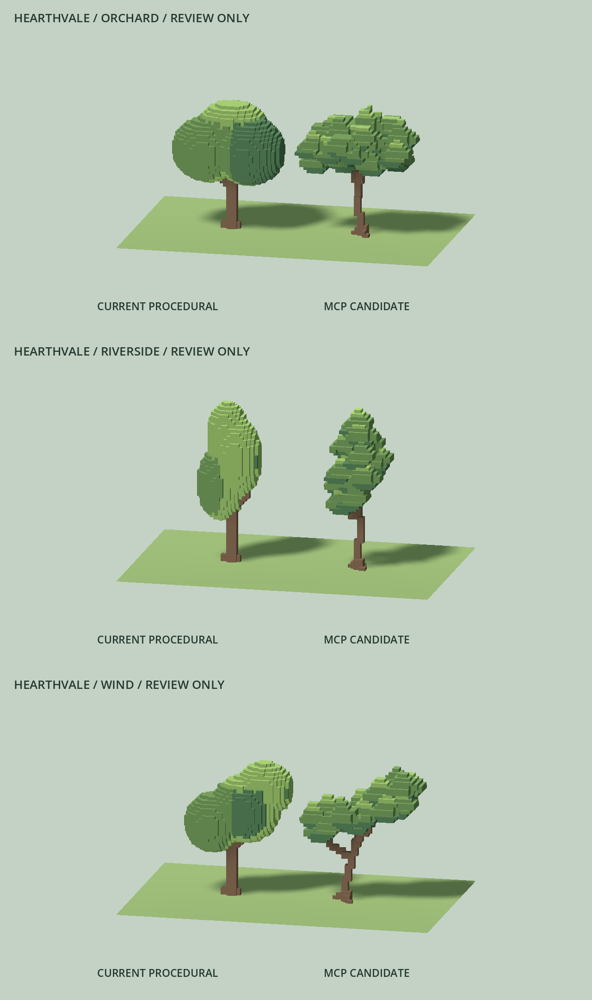

# MagicaVoxel tree review candidates

2026-09-08. Baseline: `d2535ed`. Review-only sources and baked meshes; no gameplay
tree, placement, save, existing pilot, or scene integration was changed.

## Final candidate set

| Candidate / procedural variant | Authored voxels | Baked triangles | Current triangles | Bounds X / Y / Z |
| --- | ---: | ---: | ---: | --- |
| Broad orchard / 0 | 4,933 | 2,274 | 4,860 | 4.5 / 5.0 / 2.625 |
| Tall riverside / 1 | 3,477 | 1,548 | 2,336 | 2.5 / 6.125 / 2.0 |
| Asymmetric wind-shaped / 2 | 3,982 | 1,918 | 4,066 | 4.625 / 5.125 / 2.25 |

Every structural voxel remains 0.125 world units. All candidates retain palette
groups 1–4: bark `#765942`, foliage `#638348`, shade `#486d46`, tips `#87a657`.
Declared horizontal-centre pivots and ground Y=0 are checked against source
receipts. Dimension ratios are checked against each corresponding procedural
variant, rather than the smaller pilot envelope. Every candidate is one connected
component in the MCP inspection and remains under the unchanged 8,000-triangle
candidate ceiling.

## Authoring and review

The actual registered `hearthvale-magicavoxel` tools authored every model.
The pinned server commit is `710671d49bdc89e4e3d1ff7c60541c1d0383ac16`.
The operation record is
`assets/source/magicavoxel/tree-candidates.authoring.json`; raw six-angle snapshot
images, intermediate VOX copies, and inspection sheets stay under ignored
`.tools/magicavoxel`. No Python or GDScript tree generator created these sources.
Python converts and verifies the authored sources and assembles screenshot contact
sheets; GDScript bakes and renders them. The optional game-dev CLI was not on PATH;
the user's explicitly requested existing MCP → VOX → OBJ → RES path was used.

The initial shelf-shaped blockouts were rejected by the user as too chunky.
Their large planes were replaced through MCP edits with 22 orchard, 16 riverside,
and 20 wind-shaped overlapping sprays. Each spray uses one-cell stepped layers,
offset planes and corner cut-ins; deeper crown cuts prevent a continuous dome.
The user's subsequent trunk feedback led to tapered, bent stems, thin branching
and small irregular roots. Six snapshot passes per tree were generated and
inspected across these revisions. Rejected copies remain in staging.

The user liked the revised set and requested only less repetitive tops on tree
#1. A seventh orchard snapshot pass lowers several matching caps, broadens low
shoulders and adds a taller off-centre tip with staggered small peaks. The trunk
and trees #2/#3 remain unchanged. Actual follow-up MCP operations are recorded
in `assets/source/magicavoxel/orchard-top-variation.authoring.json`.
The follow-up passed 121 headless checks, exact mesher coverage, and 125 checks
per Mobile close/normal/reverse run (`reports/logs/tree-top-*.log`). The prior
full-suite pass is reused for this source-only tweak; it was not rerun.

The final orchard spreads broadly around staggered peaks and a crown cleft;
riverside climbs through alternating narrow sprays; wind-shaped follows a
leaning stem into a long uneven crown. Fine voxel edges remain visible at close
range, and palette/shadow masses remain legible at normal review distance.
The local Station to Station reference image and current Hearthvale riverbank
capture were inspected for fine stepped vegetation, restrained colors and scale.

## Pipeline changes and validation

`vox_to_obj.py --greedy` merges only adjacent coplanar faces of the same palette
index. An exact-coverage regression expands the merged rectangles back into unit
faces and checks all three sources for missing, duplicate, internal or recolored
faces. The default, non-greedy converter still reproduces the baseline pilot OBJ
byte for byte. Invalid occupied coordinates, duplicate coordinates and non-0.125
conversion requests now fail explicitly.

The first actual Mobile render exposed imported metallic=0.999 materials.
`bake_mesh.gd` now enforces matte nonmetallic bark and foliage while preserving
palette colors. It explicitly rejects a missing/incompatible palette material.
Only the three new candidates were baked with this change; the existing pilot
was retained untouched. A bounded independent Luna/low review found no greedy
coverage issue; its scale, bounds and material-input concerns were addressed.

- Pinned Godot 4.7.2.stable.official.ed1daf0bf import and all three bakes: passed.
- Asset gate: 121 headless checks; source hashes, 0.125 vertex grid, cubic faces,
  declared pivot/bounds, procedural dimension ratios, four palette groups,
  matte materials, receipt triangle counts and triangle budgets.
- Actual Forward Mobile / Vulkan 1.4.325 on NVIDIA RTX 3070: 125 checks passed
  per run, with close/front, normal-distance and reverse captures for all three.
- `python tests/magicavoxel_converter_test.py`: passed (all three sources).
- Final `tools/check.ps1`: passed, exit 0, ending with `check ok`; includes the
  final 121-check asset gate and the existing acceptance write/cold-read gates.

Logs are ignored under `reports/logs/tree-candidates-*.log` and
`reports/logs/check-magicavoxel-asset.log`. Desktop rendering is not Thor evidence;
physical handheld performance and player visual approval remain open.

## Captures and remaining concerns

The composite vertically joins the three actual 1280×720 Mobile screenshots
without altering their rendered content. Individual close captures are
`tree-candidates-orchard.png`, `tree-candidates-riverside.png` and
`tree-candidates-wind.png`; normal and reverse files use corresponding
`tree-candidates-normal-*` and `tree-candidates-reverse-*` names. Reverse captures
label the candidate on the left. All nine final images were inspected.

These remain stylized candidates: the angular tip rhythm may still feel too
regular, and the thinner stems—especially riverside—need the player's judgement
beside the current trees. The wind-shaped trunk intentionally has the most
pronounced stepped lean. No handheld benchmark or gameplay-density test was run.
Do not infer integration approval from passing geometry or render checks.

## Reproduce

For each name `orchard`, `riverside`, `wind`, convert the canonical VOX with
`python tools/magicavoxel/vox_to_obj.py SOURCE.vox OUTPUT.obj --greedy`, run the
pinned Godot headless editor import, then run
`--headless --path . --script res://tools/magicavoxel/bake_mesh.gd -- SOURCE.obj OUTPUT.res`.
Use resource paths for the bake arguments. Run the converter test and
`tools/check.ps1`. For captures, run the pinned Godot executable with
`--path . --rendering-method mobile --script res://tests/magicavoxel_asset_test.gd -- --require-rendering --capture=res://reports/screenshots/tree-candidates.png`.
Add `--normal-distance` or `--reverse` and a distinct capture prefix for secondary
views. No gameplay integration is needed to reproduce the review.
